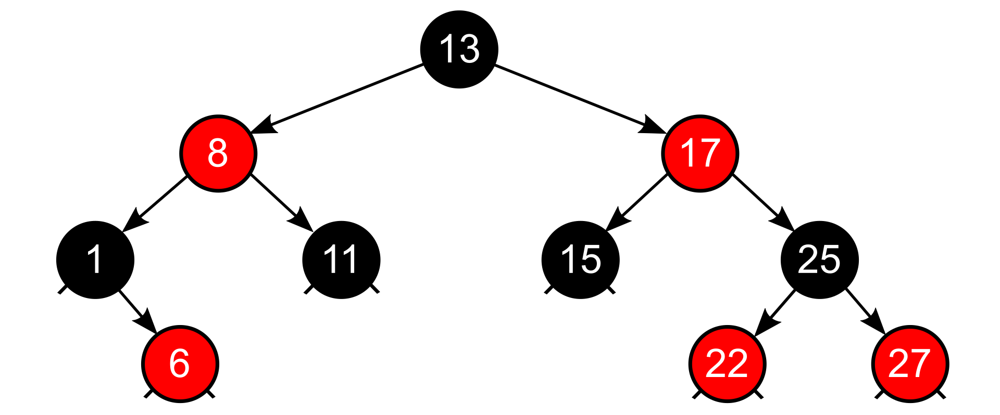

# data-structures
Collection of idfferent data structures implemented in c++
## Data Structures Implemented
* List
* Graph
* Hashing
* Binary Search Tree
* Red Black Tree

## Description
#### List Data Structure
The list can be defined as an abstract data type in which the elements are stored in an ordered manner for easier and efficient retrieval of the elements. List Data Structure allows repetition that means a single piece of data can occur more than once in a list. In the case of multiple entries of the same data, each entry of that repeating data is considered as a distinct item or entry. It is very much similar to the array but the major difference between the array and the list data structure is that array stores only homogenous data in them whereas the list (in some programming languages) can store heterogeneous data items in its object. List Data Structure is also known as a sequence.

##### Various operations on the List Data Structure:

The various operations that are performed on a List Data Structure or Sequence are:

* **Add or Insert Operation:** In the Add or Insert operation, a new item (of any data type) is added in the List Data Structure or Sequence object.

* **Replace or reassign Operation:** In the Replace or reassign operation, the already existing value in the List object is changed or modified. In other words, a new value is added at that particular index of the already existing value.

* **Delete or remove Operation:** In the Delete or remove operation, the already present element is deleted or removed from the Dictionary or associative array object.

* **Find or Lookup or Search Operation:** In the Find or Lookup operation, the element stored in that List Data Structure or Sequence object is fetched.

#### Graph Data Stucture
A graph data structure is a collection of nodes that have data and are connected to other nodes.

##### Graph Representation
Graphs are commonly represented in two ways:

**1. Adjacency Matrix**

An adjacency matrix is a 2D array of V x V vertices. Each row and column represent a vertex.

If the value of any element a[i][j] is 1, it represents that there is an edge connecting vertex i and vertex j.

The adjacency matrix for the graph we created above is

**2. Adjacency List**

An adjacency list represents a graph as an array of linked lists.

The index of the array represents a vertex and each element in its linked list represents the other vertices that form an edge with the vertex.

The adjacency list for the graph we made in the first example is as follows:

**Bridges in a Graph**
In graph theory, a bridge, isthmus, cut-edge, or cut arc is an edge of a graph whose deletion increases the graph's number of connected components. Equivalently, an edge is a bridge if and only if it is not contained in any cycle.
![bridge_example/bridge.png)
### Hashing
A hashing algorithm is a mathematical algorithm that converts an input data array of a certain type and arbitrary length to an output bit string of a fixed length. 
Hashing algorithms take any input and convert it to a uniform message by using a hashing table.
#### Conflict Resolve
Conflicts were resolved in two ways
* Linear Probing
* Separate Chaining
##### Linear Probing
Along with quadratic probing and double hashing, linear probing is a form of open addressing. 
In these schemes, each cell of a hash table stores a single key–value pair.
When the hash function causes a collision by mapping a new key to a cell of the hash table that is already occupied by another key, 
linear probing searches the table for the closest following free location and inserts the new key there. Lookups are performed in the same way, 
by searching the table sequentially starting at the position given by the hash function, until finding a cell with a matching key or an empty cell.
##### Separate Chaining
The idea is to make each cell of hash table point to a linked list of records that have same hash function value. 
#### Output

### Binary Search Tree
In computer science, a binary search tree (BST), also called an ordered or sorted binary tree, is a rooted binary tree data structure whose internal nodes each store a key greater than all the keys in the node’s left subtree and less than those in its right subtree. A binary tree is a type of data structure for storing data such as numbers in an organized way. Binary search trees allow binary search for fast lookup, addition and removal of data items, and can be used to implement dynamic sets and lookup tables. The order of nodes in a BST means that each comparison skips about half of the remaining tree, so the whole lookup takes time proportional to the binary logarithm of the number of items stored in the tree. This is much better than the linear time required to find items by key in an (unsorted) array, but slower than the corresponding operations on hash tables. 

### Red Black Tree
In computer science, a **red–black tree** is a kind of self-balancing binary search tree. Each node stores an extra bit representing "color" (**"red"** or **"black"**), used to ensure that the tree remains balanced during insertions and deletions.

When the tree is modified, the new tree is rearranged and "repainted" to restore the coloring properties that constrain how unbalanced the tree can become in the worst case. The properties are designed such that this rearranging and recoloring can be performed efficiently.

with explicit NIL leaves |  with implicit left and right docking points
:-------------------------:|:-------------------------:
 | 
